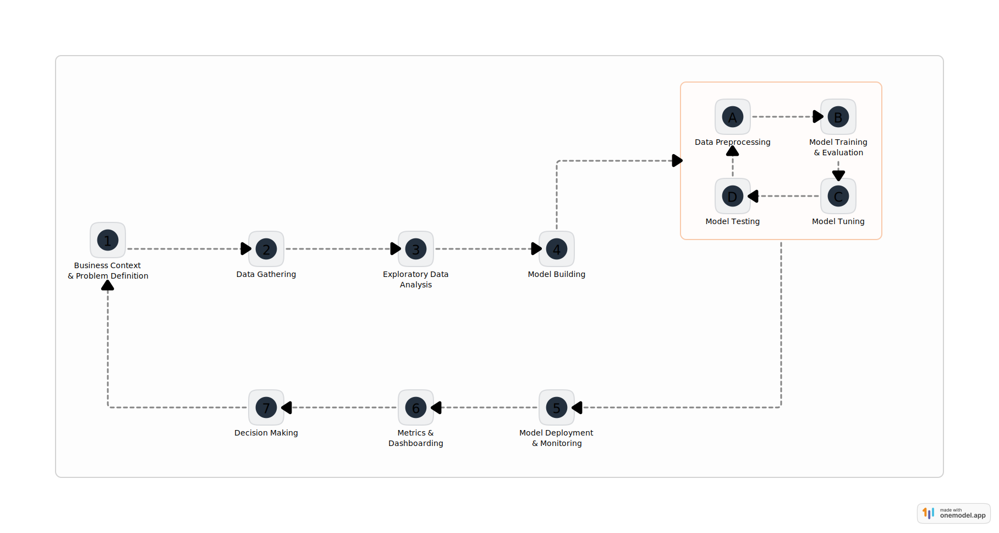

# Hotel Booking Cancellation Prediction Case Study


## Business Context

In the modern era of travel, online hotel booking platforms have revolutionized the way customers plan their stays. These platforms provide the convenience of reserving rooms in advance, often accompanied by flexible cancellation policies. This flexibility, while beneficial for customers, has introduced significant challenges for hotel operators. Customers frequently cancel bookings due to unforeseen circumstances such as personal emergencies, changes in travel plans, or external factors like flight delays and weather conditions. This trend has been further amplified by offline booking channels adopting similar flexible cancellation policies to remain competitive.

The repercussions of booking cancellations are multifaceted and deeply impact hotel operations:

1. **Revenue Loss**: Unsold rooms directly translate to lost revenue, especially when cancellations occur close to the booking date.
2. **Increased Costs**: Hotels often resort to higher distribution channel commissions or additional marketing efforts to resell canceled rooms.
3. **Reduced Profit Margins**: Last-minute price reductions to fill vacant rooms erode profitability.

Addressing this issue is critical for maintaining financial stability and operational efficiency in the hospitality industry.

## Problem Statement

The INN Hotels Group, a prominent player in the hospitality sector, has been grappling with a surge in booking cancellations over the past year. The situation has reached a critical point in the last three months, with inventory loss due to cancellations peaking at 18%. This has resulted in an annual revenue loss of approximately $0.25 million, significantly affecting the group's profit margins.

Historically, the group relied on heuristic methods—rule-based and domain expert-driven approaches—to mitigate cancellation impacts. However, these methods have proven inadequate in addressing the scale and complexity of the problem. The need for a more robust, scalable, and effective solution has become evident.

To combat this challenge, the INN Hotels Group aims to leverage artificial intelligence to predict the likelihood of booking cancellations. By adopting a proactive approach, the group seeks to:

- Minimize revenue loss by identifying high-risk bookings in advance.
- Optimize operational strategies, such as overbooking or targeted promotions, to counteract potential cancellations.
- Enhance overall efficiency and profitability by making data-driven decisions.

## Solution Workflow

The AI solution workflow for this case study is as follows:

### 1. Business Context & Problem Definition
- Understand the business problem and its impact on revenue and operations.
- Define the problem statement and set clear objectives for the AI-based solution.

### 2. Data Gathering
- Collect historical booking data from the INN Hotels Group.
- Ensure data quality by handling missing values, duplicates, and inconsistencies.
- Store the data in the `data/` folder, including files like `INNHotelsGroup_pastdata.csv` and `INNHotelsGroup_newdata.csv`.

### 3. Exploratory Data Analysis (EDA)
- Perform EDA to understand the data distribution, relationships, and patterns.
- Use visualizations (e.g., bar plots, stacked bar plots) to gain insights into booking trends and cancellation behavior.
- Scripts for EDA are implemented in `labeled_barplot.py` and `stacked_barplot.py`.

### 4. Model Building
- Use machine learning algorithms to build a predictive model for booking cancellations.
- Train and validate the model using historical data.
- Optimize the model using techniques like grid search.

### 5. Model Deployment & Monitoring
- Deploy the predictive model to a production environment.
- Monitor the model's performance and update it periodically to ensure accuracy.

### 6. Metrics & Dashboarding
- Define key performance metrics (e.g., accuracy, precision, recall, F1-score) to evaluate the model.
- Create dashboards to visualize the predictions and monitor cancellations in real-time.

### 7. Decision Making
- Use the model's predictions to make proactive decisions, such as offering discounts or overbooking strategies to minimize revenue loss.

## Repository Structure

```
ai-case-studies/
    hotel-booking-cancellation-prediction/
        labeled_barplot.py       # Script for creating labeled bar plots for EDA
        stacked_barplot.py       # Script for creating stacked bar plots for EDA
        main.py                  # Main script for data loading, visualization, and analysis
        requirements.txt         # Dependencies for the project
        data/                    # Folder containing historical booking data
            INNHotelsGroup_pastdata.csv
            INNHotelsGroup_newdata.csv
```

## How to Run the Project

1. **Install Dependencies**:
   ```bash
   pip install -r requirements.txt
   ```

2. **Run the Streamlit App**:
   ```bash
   streamlit run main.py
   ```

   This will launch a web-based UI where you can view the sample data and visualizations interactively.

3. **Run Tests**:
   Test cases are provided for all scripts. Use the following command to run the tests:
   ```bash
   pytest
   ```

## Visual Workflow Diagram

Below is a high-level workflow diagram for the AI solution:




## Key Files

- **`labeled_barplot.py`**: Contains functions for creating labeled bar plots to visualize categorical data.
- **`stacked_barplot.py`**: Contains functions for creating stacked bar plots to analyze relationships between variables.
- **`main.py`**: The main script for loading data, performing EDA, and visualizing results.
- **`requirements.txt`**: Lists the dependencies required for the project.

## Future Enhancements

- Incorporate additional features like customer demographics and booking channels to improve model accuracy.
- Develop a web-based dashboard for real-time monitoring and decision-making.
- Implement automated model retraining to adapt to changing booking patterns.