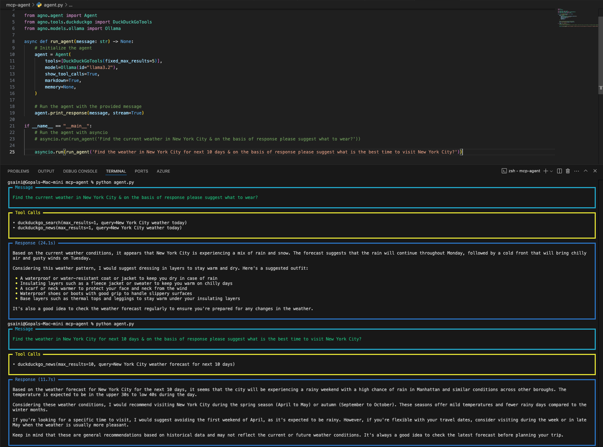

# MCP Agent


This project demonstrates the use of an [MCP (Model Context Protocol)](https://modelcontextprotocol.io/introduction) agent to interact with language models and tools (i.e. [mcp registry](https://mastra.ai/mcp-registry-registry)) for answering complex queries. The agent is built using the `agno` library and integrates the following components:

- **Language Model**: The agent uses the `Ollama` model (version `llama3.2`) for natural language understanding and response generation.
- **Tools**: The agent integrates `DuckDuckGoTools` to fetch real-time information from the web, such as weather updates and news articles.
- **Features**:
  - Supports real-time tool calls to fetch external data.
  - Provides markdown-formatted responses for better readability.
  - Streams responses for a more interactive experience.

## How It Works

The agent is initialized with the following components:

1. **Tools**: The `DuckDuckGoTools` is configured to fetch up to 5 results for each query.
2. **Model**: The `Ollama` model is used to process the input query and generate responses.
3. **Memory**: The agent does not use memory in this implementation, making it stateless.

The agent processes user queries by:

1. Parsing the input message.
2. Using the integrated tools to fetch relevant data.
3. Generating a response based on the fetched data and the language model's capabilities.

## Popular MCP Servers

If you're exploring MCP (Model Context Protocol) agents, you might find these MCP servers helpful for deployment, testing, or benchmarking your implementations:

* [Model Context Protocol Servers Repository](https://github.com/modelcontextprotocol/servers): A comprehensive repository featuring popular MCP servers, deployment guidelines, and advanced usage examples.
* **Examples of MCP Servers:**

  - **MCP Core Server:** A lightweight server for quickly spinning up MCP environments, ideal for prototyping.
  - **MCP Advanced Server:** Comes with extended features, such as multi-tool integration and advanced logging capabilities.
  - **MCP Cloud Server:** Optimized for cloud-based deployments, offering scalability and performance enhancements.

These servers provide a great starting point for understanding and working with MCP, whether you're developing new agents or testing existing ones.

## Example Queries

### Query 1: "Find the current weather in New York City & on the basis of response please suggest what to wear?"

**Response**:
- The agent fetches the current weather conditions in New York City using `DuckDuckGoTools`.
- Based on the weather data, it provides clothing recommendations, such as wearing waterproof layers and insulating garments.

### Query 2: "Find the weather in New York City for the next 10 days & on the basis of response please suggest what is the best time to visit New York City?"

**Response**:
- The agent retrieves a 10-day weather forecast for New York City.
- It analyzes the forecast to suggest the best time to visit, considering factors like rain and temperature.

## Screenshot

Below is a screenshot of the agent in action, showcasing its ability to fetch weather data and provide meaningful recommendations:



## How to Run

1. Install the required dependencies:
   ```bash
   pip install -r requirements.txt
   ```

2. Run the agent script:
   ```bash
   python agent.py
   ```

3. Modify the query in the `agent.py` file to test different scenarios.

## Requirements

- Python 3.8 or higher
- Dependencies listed in `requirements.txt`

## Future Enhancements

- Add support for more tools to expand the agent's capabilities.
- Integrate memory for context-aware conversations.
- Improve response formatting and user interaction.
