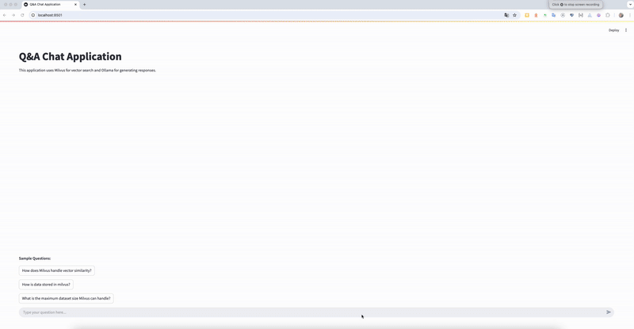

# Milvus RAG with Ollama


This directory contains applications and utilities for building a Retrieval-Augmented Generation (RAG) system using Milvus for vector search and Ollama for generating responses. The system is designed to handle Q&A and chat-based applications by leveraging embeddings and vector similarity search.

## Overview
The Milvus RAG system integrates:
- **Milvus**: A vector database for efficient similarity search and storage of embeddings.
- **Ollama**: A language model for generating responses based on retrieved context.

## Screenshot


## Applications

### 1. **Milvus App**
- **Description**: A script to create a Milvus collection, insert embeddings, and perform vector search.
- **Features**:
  - Embedding generation for text data.
  - Milvus collection creation and data insertion.
  - Vector similarity search for retrieving relevant context.
- **How to Run**:
  1. Install dependencies from `requirements.txt`.
  2. Run the `milvus_app.py` script.

### 2. **Q&A Chat Application**
- **Description**: A Streamlit-based interactive Q&A application that uses Milvus for vector search and Ollama for generating responses.
- **Features**:
  - User-friendly interface for asking questions.
  - Real-time vector search and response generation.
- **How to Run**:
  1. Install dependencies from `requirements.txt`.
  2. Run the `qa_chat_app.py` script using Streamlit:
     ```bash
     streamlit run qa_chat_app.py
     ```

## Utilities

### 1. **`utils/milvus_utils.py`**
- Contains functions for:
  - Creating Milvus collections.
  - Inserting data into collections.
  - Performing vector similarity search.

### 2. **`utils/chat_utils.py`**
- Contains functions for generating chat responses using Ollama.

### 3. **`utils/file_utils.py`**
- Contains functions for loading text data from files.

### 4. **`utils/embeddings_utils.py`**
- Contains functions for generating embeddings from text.

## Requirements
- Python 3.8 or higher
- Dependencies listed in `requirements.txt`

## Installation
1. Clone the repository:
   ```bash
   git clone <repository-url>
   cd milvus-rag-ollama
   ```
2. Create a virtual environment and activate it:
   ```bash
   python3 -m venv venv
   source venv/bin/activate  # On Windows use `venv\Scripts\activate`
   ```
3. Install the required dependencies:
   ```bash
   pip install -r requirements.txt
   ```

## Project Structure
- **`milvus_app.py`**: Script for creating collections, inserting data, and performing vector search.
- **`qa_chat_app.py`**: Streamlit application for Q&A chat.
- **`utils/`**: Directory containing utility scripts for Milvus operations, embedding generation, and file handling.
- **`requirements.txt`**: Lists all the dependencies required for the project.

## Future Enhancements
- Add support for batch processing of multiple queries.
- Integrate additional language models for response generation.
- Provide downloadable logs and analytics for user interactions.

## Contributions
Contributions are welcome! Feel free to open issues or submit pull requests to improve the project.

## License
This project is licensed under the MIT License. See the LICENSE file for details.

## Reference

For more details on building a Retrieval-Augmented Generation (RAG) system with Milvus and Ollama, refer to the [official Milvus documentation](https://milvus.io/docs/build_RAG_with_milvus_and_ollama.md).