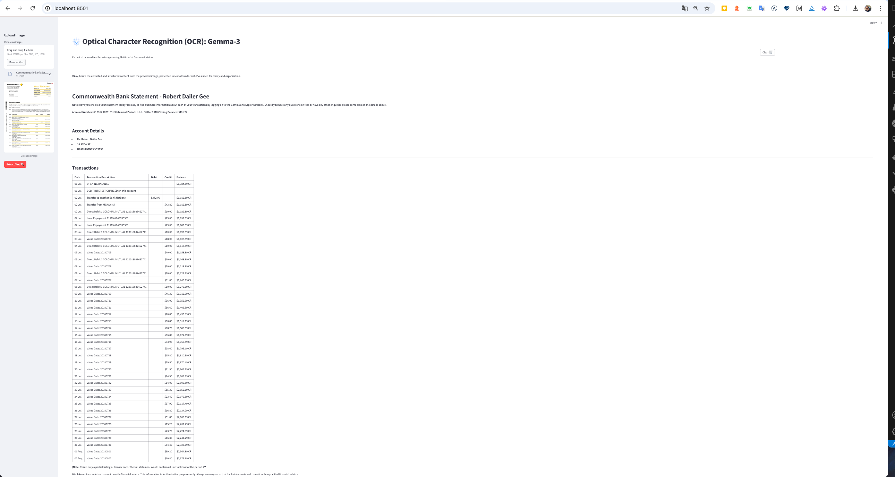

# Optical Character Recognition (OCR): Gemma-3


## Overview
The Optical Character Recognition (OCR) project leverages the Gemma-3 model to extract structured text from images. This application is built using Streamlit and integrates advanced AI capabilities to analyze and process images, providing users with clear and concise text outputs in Markdown format.

## About Gemma-3

Gemma-3 is a state-of-the-art AI model developed by Google, designed to run efficiently on a single GPU or TPU. It is part of the Gemma family of open models, which are built on the same research and technology that powers Google's Gemini 2.0 models. Gemma-3 is optimized for performance and accessibility, making it ideal for developers to create AI applications across various platforms.

### Key Features of Gemma-3
- **Advanced Capabilities**: Gemma-3 offers cutting-edge text and visual reasoning capabilities, enabling it to analyze images, text, and even short videos.
- **Global Language Support**: With support for over 140 languages, Gemma-3 allows developers to build applications that cater to a global audience.
- **Expanded Context Window**: The model features a 128k-token context window, allowing it to process and understand vast amounts of information.
- **Function Calling**: Supports structured outputs and function calling, making it easier to automate tasks and build intelligent workflows.
- **Optimized Performance**: Gemma-3 introduces quantized versions, reducing model size and computational requirements while maintaining high accuracy.
- **Seamless Integration**: Compatible with popular tools like Hugging Face, Ollama, and Google AI Studio, providing flexibility for developers.

### Responsible Development
Gemma-3 has been developed with rigorous safety protocols to ensure responsible use. It includes extensive data governance, alignment with safety policies, and robust benchmark evaluations to minimize risks and promote ethical AI development.

### Applications
Gemma-3 is versatile and can be used in various applications, including:
- Optical Character Recognition (OCR)
- Natural Language Processing (NLP)
- Image and Video Analysis
- AI-driven Workflows

For more details, visit the [official Gemma-3 blog](https://blog.google/technology/developers/gemma-3/).

## Features
- **Image Upload**: Upload images in various formats (PNG, JPG, JPEG) for text extraction.
- **Text Extraction**: Uses the Gemma-3 model to analyze images and extract readable text.
- **Structured Output**: Presents extracted text in a well-organized Markdown format, including headings, lists, and code blocks where applicable.
- **Interactive UI**: Built with Streamlit for an intuitive and user-friendly experience.

## Requirements
- Python 3.8 or higher
- Dependencies listed in `requirements.txt`

## Installation
1. Clone the repository:
   ```bash
   git clone <repository-url>
   cd optical-character-recognition
   ```
2. Create a virtual environment and activate it:
   ```bash
   python3 -m venv venv
   source venv/bin/activate  # On Windows use `venv\Scripts\activate`
   ```
3. Install the required dependencies:
   ```bash
   pip install -r requirements.txt
   ```

## Usage
1. Run the Streamlit application:
   ```bash
   streamlit run app.py
   ```
2. Use the sidebar to upload an image.
3. Click the "Extract Text 🔍" button to process the image.
4. View the extracted text in the main content area.

## Results Screenshot

Below is a screenshot of the OCR results generated by the application:



## Project Structure
- **`app.py`**: Main application file for the Streamlit interface.
- **`ocr_helper.py`**: Contains the logic for processing images and extracting text using the Gemma-3 model.
- **`sidebar_upload.py`**: Handles the image upload functionality in the sidebar.
- **`clear_button.py`**: Adds a clear button to reset the application state.
- **`requirements.txt`**: Lists all the dependencies required for the project.
- **`assets/`**: Contains static assets like images used in the application.

## Future Enhancements
- Add support for batch processing of multiple images.
- Integrate additional AI models for enhanced OCR capabilities.
- Provide downloadable outputs in various formats (e.g., PDF, DOCX).

## Contributions
Contributions are welcome! Feel free to open issues or submit pull requests to improve the project.

## License
This project is licensed under the MIT License. See the LICENSE file for details.