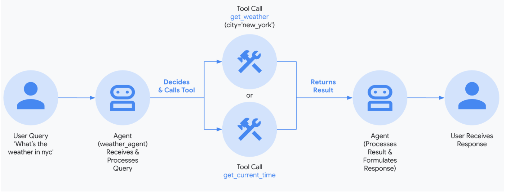
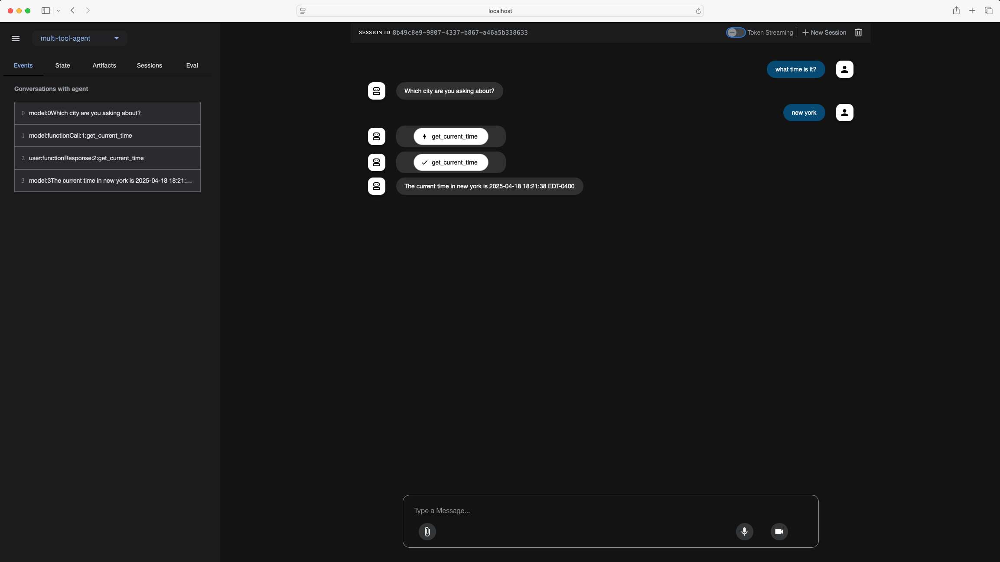

# Multi-Tool Agent

This project is a proof of concept (POC) to explore the capabilities of Google ADK (Agent Development Kit) for building AI agents. The goal is to create agents that can perform specific tasks using tools and models provided by Google ADK.

## About Google ADK

Google ADK is a framework for building AI agents that can interact with users, perform tasks, and integrate with external tools and APIs. It provides a flexible architecture for creating agents with custom tools, memory, and state management.

## Project Overview

The `multi-tool-agent` project demonstrates the following features:

- **Custom Tools**: The agent uses custom tools like `get_weather` and `get_current_time` to provide weather and time information for a specified city.
- **Google ADK Integration**: The project leverages Google ADK's `Agent` class to define and run the agent.
- **Gemini Model**: The agent uses the `gemini-2.0-flash` model for natural language understanding and response generation.

## How It Works

1. **Agent Initialization**:
   - The agent is initialized with a name, description, and instruction.
   - Custom tools (`get_weather` and `get_current_time`) are registered with the agent.

2. **Custom Tools**:
   - `get_weather`: Retrieves the current weather report for a specified city.
   - `get_current_time`: Returns the current time in a specified city.

3. **Agent Execution**:
   - The agent processes user queries and calls the appropriate tools to generate responses.

### Agent Workflow


## Example Queries

### Query 1: "What is the weather in New York?"
**Response**:
- The agent calls the `get_weather` tool to fetch the weather report for New York.
- Example Output: "The weather in New York is sunny with a temperature of 25 degrees Celsius (41 degrees Fahrenheit)."

### Query 2: "What is the time in New York?"
**Response**:
- The agent calls the `get_current_time` tool to fetch the current time in New York.
- Example Output: "The current time in New York is 2025-04-18 14:30:00 EDT-0400."

## How to Run

1. **Set up Environment**:
   - Create and activate a virtual environment:
     ```bash
     python -m venv .venv
     source .venv/bin/activate  # macOS/Linux
     .venv\Scripts\activate   # Windows
     ```

2. **Install Dependencies**:
   - Navigate to the `multi-tool-agent` directory: 
   - Install Google ADK:
     ```bash
     pip install -r requirements.txt
     ```
3. ** Update API Key**:
    - Replace GOOGLE_API_KEY with your actual API KEY.

3. **Run the Agent**:
   - Navigate to the parent directory of `multi-tool-agent`:
   - Run the agent script: (Using Dev UI)
     ```bash
     adk web
     ```
    

4. **Interact with the Agent**:
   - Use the terminal or ADK's Dev UI to interact with the agent.

### Agentic Dev UI



## Requirements

- Python 3.9 or higher
- Google ADK

## Future Enhancements

- Add more tools to expand the agent's capabilities.
- Integrate memory and state management for context-aware interactions.
- Explore advanced features like voice and video streaming using Gemini Live API.